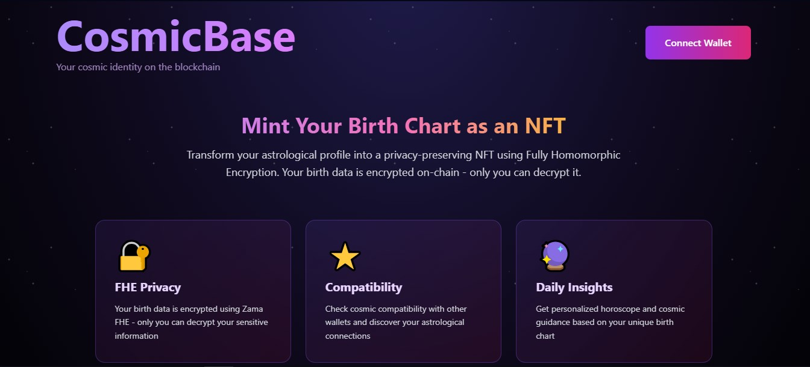

# CosmicBase

A privacy-preserving astrology NFT application built with Zama FHEVM. Users can mint their birth chart as an NFT while keeping sensitive birth data encrypted on-chain.

**Live Demo:** https://cosmicbase.app



## Problem

Birth charts contain sensitive personal information including exact birth date, time, and location. Traditional NFT solutions store this data in plain text, creating privacy and security risks. This information can be used for identity theft or personal profiling.

## Solution

CosmicBase uses Zama's Fully Homomorphic Encryption (FHE) to encrypt birth data before storing it on-chain. Only the NFT owner can decrypt and view their private information. The application displays public astrological signs (Sun, Moon, Rising) while keeping the underlying birth data completely private.

## How It Works

1. User connects wallet and enters birth information
2. Frontend encrypts the data using fhevmjs
3. Encrypted data is sent to the smart contract
4. Contract stores encrypted values using FHEVM types
5. NFT is minted with public signs and encrypted private data
6. Only the owner can request decryption of their birth data

## Smart Contract

The FHECosmicBaseNFT contract stores encrypted birth data using Zama's FHEVM types:

```solidity
struct EncryptedBirthData {
    euint16 birthYear;
    euint8 birthMonth;
    euint8 birthDay;
    euint8 birthHour;
    euint8 birthMinute;
    euint32 latitude;
    euint32 longitude;
}
```

Key implementation details:
- Uses @fhevm/solidity v0.9.1
- Encrypted inputs via externalEuint types
- Access control with FHE.allow() and FHE.allowThis()
- Coordinates stored as offset-encoded unsigned integers

## Deployed Contract

| Network | Address | Verified |
|---------|---------|----------|
| Ethereum Sepolia | 0xD0CC51718B89456d33BF14d5019228646838636F | [Etherscan](https://sepolia.etherscan.io/address/0xD0CC51718B89456d33BF14d5019228646838636F#code) |

## Tech Stack

- Zama FHEVM (@fhevm/solidity v0.9.1, fhevmjs)
- Solidity 0.8.24
- Hardhat
- Next.js 14
- Wagmi v2 / Viem
- IPFS (Pinata)
- TailwindCSS

## Installation

```bash
git clone https://github.com/AstroXWinner/cosmicbase.git
cd cosmicbase

# Install dependencies
npm install

# Install frontend dependencies
cd frontend
npm install
```

## Environment Setup

Create `frontend/.env.local`:

```
NEXT_PUBLIC_FHE_CONTRACT_ADDRESS=0xD0CC51718B89456d33BF14d5019228646838636F
NEXT_PUBLIC_WALLETCONNECT_PROJECT_ID=your_project_id
NEXT_PUBLIC_INFURA_API_KEY=your_infura_key
NEXT_PUBLIC_PINATA_JWT=your_pinata_jwt
```

Create `contracts-fhe/.env`:

```
PRIVATE_KEY=your_private_key
INFURA_API_KEY=your_infura_key
ETHERSCAN_API_KEY=your_etherscan_key
```

## Running Locally

```bash
cd frontend
npm run dev
```

Open http://localhost:3000

## Deploying Contracts

```bash
cd contracts-fhe
npm install
npx hardhat compile
npx hardhat run scripts/deploy.ts --network sepolia
```

## Project Structure

```
cosmicbase/
├── contracts-fhe/
│   ├── contracts/
│   │   └── FHECosmicBaseNFT.sol
│   ├── scripts/
│   │   └── deploy.ts
│   └── hardhat.config.ts
├── frontend/
│   └── src/
│       ├── app/
│       ├── components/
│       ├── config/
│       └── lib/
│           ├── fhe.ts
│           ├── astrology.ts
│           └── pinata.ts
└── README.md
```

## FHE Integration

The frontend uses fhevmjs to encrypt user input:

```typescript
const input = instance.createEncryptedInput(contractAddress, userAddress)

input.add16(birthData.year)
input.add8(birthData.month)
input.add8(birthData.day)
input.add8(birthData.hour)
input.add8(birthData.minute)
input.add32(latitudeInt)
input.add32(longitudeInt)

const encrypted = input.encrypt()
```

Encrypted handles and input proof are sent to the contract. The contract verifies and stores the encrypted values, granting access only to the token owner.

## Testing

The application is deployed on Ethereum Sepolia testnet. You need Sepolia ETH to mint NFTs.

To test:
1. Visit https://cosmicbase.app
2. Connect your wallet (MetaMask or WalletConnect)
3. Enter birth information
4. Approve transaction to mint NFT
5. View your encrypted birth chart NFT

## License

MIT

## Links

- Live App: https://cosmicbase.app
- Contract: https://sepolia.etherscan.io/address/0xD0CC51718B89456d33BF14d5019228646838636F#code
- Zama FHEVM: https://docs.zama.ai/fhevm
