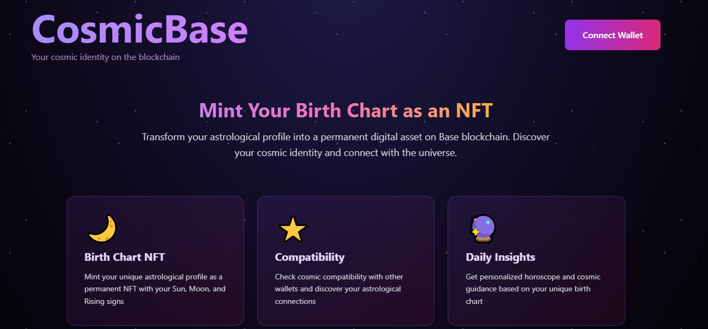
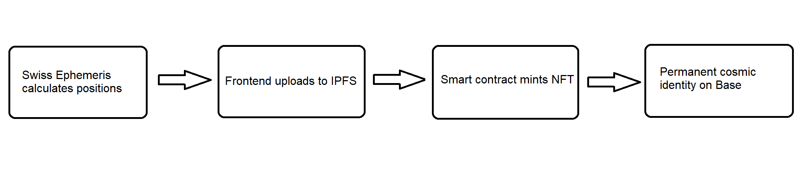

# CosmicBase

> Onchain Astrology Profile Platform on Base

CosmicBase is a decentralized application that creates immutable birth chart NFTs on the Base blockchain, combining professional Swiss Ephemeris calculations with blockchain technology.

🌐 **Live Demo:** https://cosmicbase.app

🎥 **Demo Video:** [Watch on YouTube](https://youtu.be/VN8ztRjQA6o) | [Download](docs/CosmicBase.mp4)



## Features

- **Birth Chart NFT**: Mint your unique astrological profile as an NFT
- **Swiss Ephemeris**: Professional-grade planetary calculations
- **Compatibility Check**: Compare cosmic compatibility with other wallets
- **Basename Integration**: Display readable names instead of addresses (yourname.base.eth)
- **Fully Decentralized**: IPFS + Base blockchain (no database)
- **Privacy-Preserving**: Birth data hashed onchain, full details on IPFS

## Tech Stack

- **Smart Contracts**: Solidity + Hardhat
- **Frontend**: Next.js 14 + TypeScript
- **Web3**: wagmi + viem
- **UI**: Tailwind CSS + shadcn/ui
- **Astrology**: Swiss Ephemeris
- **Storage**: IPFS (Pinata)
- **Blockchain**: Base Sepolia Testnet

## Project Structure

```
CosmicBase/
├── contracts/          # Smart contracts (Hardhat)
├── frontend/          # Next.js application
└── docs/             # Documentation
```

## Quick Start

### Prerequisites

- Node.js 18+
- npm or yarn
- MetaMask or compatible wallet

### Installation

```bash
# Install dependencies
npm install

# Setup contracts
cd contracts
npm install

# Setup frontend
cd ../frontend
npm install
```

### Development

```bash
# Run smart contract tests
npm run test:contracts

# Deploy to Base Sepolia
npm run deploy:testnet

# Run frontend dev server
npm run dev
```

## Smart Contract

### CosmicBaseNFT - ERC-721 NFT Contract

**Deployment Details:**
- **Contract Address**: `0xb8c8cec09d8e43acafbb054b9244a81319caffc1`
- **Network**: Base Sepolia Testnet
- **Chain ID**: 84532
- **Contract Name**: CosmicBase Birth Chart
- **Symbol**: COSMIC
- **View on BaseScan**: [https://sepolia.basescan.org/token/0xb8c8cec09d8e43acafbb054b9244a81319caffc1](https://sepolia.basescan.org/token/0xb8c8cec09d8e43acafbb054b9244a81319caffc1)

**Features:**
- Mint birth chart NFTs (one per address)
- Store birth data hash (privacy-preserving)
- IPFS metadata integration
- Onchain compatibility calculation
- Sun, Moon, and Rising sign storage
- ERC-721 standard compliance

**Key Functions:**
```solidity
mintBirthChart(bytes32 birthDataHash, string metadataURI, uint8 sunSign, uint8 moonSign, uint8 risingSign)
getBirthChart(uint256 tokenId)
calculateCompatibility(uint256 tokenId1, uint256 tokenId2)
hasUserMinted(address user)
```

**How to Interact:**
1. Visit [cosmicbase.app](https://cosmicbase.app)
2. Connect your wallet (MetaMask, Coinbase Wallet, etc.)
3. Make sure you're on Base Sepolia testnet
4. Enter your birth details and mint your NFT
5. View your birth chart and check compatibility with other addresses

## Architecture

CosmicBase follows a decentralized architecture that ensures your astrological data is permanent, private, and truly owned by you.



### How It Works:

1. **Swiss Ephemeris Calculation**: Professional-grade astronomical calculations determine exact planetary positions at your birth time
2. **IPFS Upload**: Frontend securely uploads your complete birth chart data to IPFS via Pinata for permanent decentralized storage
3. **NFT Minting**: Smart contract on Base Sepolia mints your unique ERC-721 NFT with your Sun, Moon, and Rising signs
4. **Permanent Identity**: Your cosmic profile lives forever on the blockchain, fully owned and controlled by you

### Technical Stack:
- **Calculations**: Swiss Ephemeris (NASA JPL precision)
- **Storage**: IPFS via Pinata (decentralized, permanent)
- **Blockchain**: Base Sepolia (Layer 2, low gas fees)
- **Contract**: ERC-721 (standard NFT protocol)
- **Privacy**: Birth data hashed onchain, full details on IPFS

## Basenames Integration

CosmicBase integrates with Base's naming service (Basenames) to provide a better user experience:

- **Automatic Resolution**: Wallet addresses are automatically resolved to readable `.base.eth` names
- **Navbar Display**: Your Basename appears in the wallet connection display
- **Profile View**: NFT profiles show Basenames instead of truncated addresses
- **BaseScan Links**: Click any address/basename to view on BaseScan
- **Graceful Fallback**: On testnet (Sepolia), addresses are displayed in shortened format

**Note:** Basenames are currently only available on Base Mainnet. The app gracefully falls back to displaying shortened addresses (0x1234...5678) on testnet.

**How to get a Basename (Mainnet only):**
1. Visit [base.org/names](https://www.base.org/names)
2. Search for your desired name
3. Register your `.base.eth` name
4. When the app is used on Base Mainnet, your Basename will automatically appear!

## Base Batches 002: Builder Track

This project is built for Base Batches 002: Builder Track.

### Competition Requirements:

✅ **Completed:**
- Functioning onchain app on Base Sepolia
- Open-source GitHub repository
- Smart contract deployed and verified
- Publicly accessible URL (https://cosmicbase.app)
- Multiple transactions on Base testnet
- Demo video (Intro, Demo, Problem, Solution, Architecture)
- Basenames integration (automatic address resolution to readable names)

## Privacy

Birth data is stored as a hash onchain, with full details stored in IPFS metadata. Users maintain full control over their astrological data.

## License

MIT
